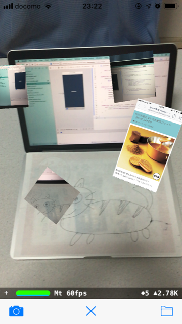

## Camera AR

*子どもと一緒に楽しめるかも...アプリ*  
*※スクリーンショットを`SCNNode.simdTransform`で設定すると、どうしても90度右回転した状態で設定されてしまうので、仕方なく/調べる時間もないので無理やり`UIImageを90度左回転`させて使用(写真が小っさくなってしまったのが残念、、、)*

1. 概要

    - AR上で写真を撮る(保存しない)
    - AR上にカメラロールの写真を配置する
    - 端末から10cm奥に写真を配置する

1. 環境

    - Xcode 10.1
    - Swift 4.2.1
    - Man-hour 3.0h

1. 学び / ポイント

    - AR機能の使い方 / SceneKit, ARKit
    - カメラロールから写真を取得する方法 / UIImagePickerController

1. イメージ

    |                          Screen1                           |
    |------------------------------------------------------------|
    |  |

1. ソースコード

    [GitHub](https://github.com/nsuhara/swift-CameraAR.git)
